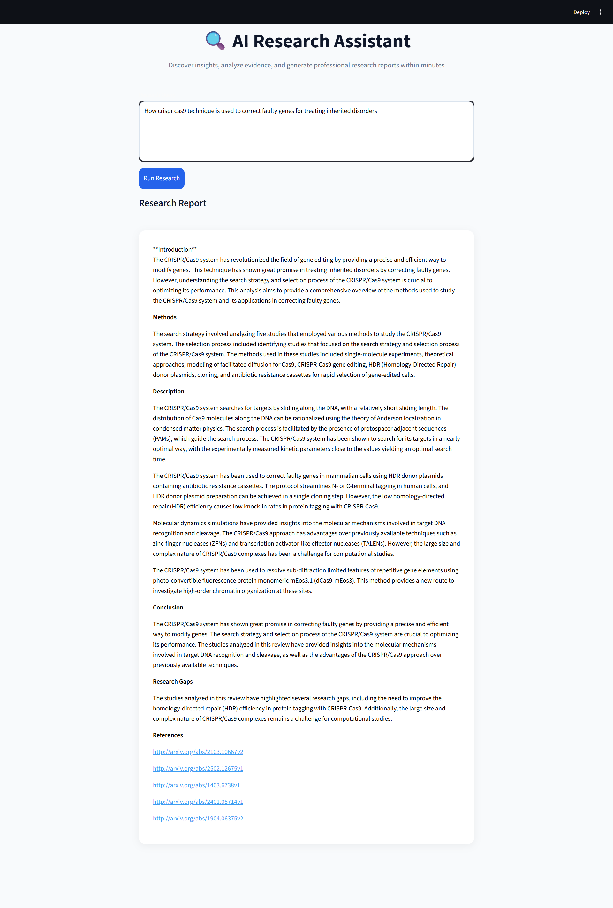

#  Research Analyst

An AI-powered **multi-agent research assistant** that automatically searches scientific literature, extracts key findings, identifies research gaps, and generates structured research summaries.

The system integrates:

* **FastAPI backend**
* **Streamlit frontend**
* **LangGraph multi-agent workflow**
* **Groq LLM inference**
* **PubMed + ArXiv scientific search**

This tool helps researchers quickly analyze scientific literature and generate structured reports from multiple sources.

---

# Features

*  **Automated Literature Search**

  * Searches **PubMed** and **ArXiv**

* **AI Multi-Agent Workflow**

  * Paper search agent
  * Extraction agent
  * Research gap detection agent
  * Report generation agent

* **Parallel Execution**

  * Concurrent paper retrieval
  * Concurrent LLM extraction
  * Optimized for local machines

* **Structured Research Reports**

  * Introduction
  * Methods
  * Literature synthesis
  * Conclusions
  * Research gaps
  * References

* **User Interface**

  * Simple Streamlit interface for entering research questions

---

# Project Architecture

```
AI_research_assistant/
│
├── backend/
│   ├── app/
│   │
│   │   ├── config.py
│   │   ├── models.py
│   │   ├── workflow.py
│   │
│   │   ├── llm/
│   │   │   └── groq_client.py
│   │
│   │   ├── search/
│   │   │   ├── pubmed.py
│   │   │   └── arxiv.py
│   │
│   │   └── nodes/
│   │       ├── search_node.py
│   │       ├── extract_node.py
│   │       ├── gap_node.py
│   │       └── format_node.py
│   │
│   ├── main_fastapi.py
│   └── requirements.txt
│
├── frontend/
│   └── streamlit_app.py
│
├── run_project.bat
└── README.md
```

---

# System Architecture

```
User Question
      │
      ▼
Streamlit Frontend
      │
      ▼
FastAPI Backend
      │
      ▼
LangGraph Workflow
      │
 ┌────┼─────────────┐
 │    │             │
 ▼    ▼             ▼
Search Agent   Extraction Agent   Gap Agent
 │             │
 ▼             ▼
PubMed       Groq LLM
ArXiv
      │
      ▼
Report Generation Agent
      │
      ▼
Structured Research Output
```

---

# Sample Output
Below is a real sample output generated by the system, showing both the Streamlit frontend and AI-generated research report.


---

# Installation

## Clone or Download Project

```
git clone <repo-url>
cd biomedical_research_analyst
```

Or simply download the project folder.


# Install Dependencies

Navigate to backend folder:

```
cd backend
pip install -r requirements.txt
```

---

# Configure API Keys

Create a `.env` file in the project root:

```
GROQ_API_KEY=your_groq_api_key_here
```

You can obtain a Groq API key from:

https://console.groq.com

---

# Running the Application

## Option 1 — Run Manually

### Start Backend

```
cd backend
uvicorn main_fastapi:app --reload
```

Backend runs at:

```
http://127.0.0.1:8000
```

API documentation:

```
http://127.0.0.1:8000/docs
```

---

### Start Frontend

Open a new terminal:

```
cd frontend
streamlit run streamlit_app.py
```

Streamlit UI:

```
http://localhost:8501
```

---

## Option 2 — Run With One Click

Double-click:

```
run_project.bat
```

This will automatically launch:

* FastAPI backend
* Streamlit frontend

---

## Current Limitations
This system has been developed under limited GPU and computational resources.

Despite this, it performs effectively in:

* Literature retrieval
* Information extraction
* Research gap detection
* Structured report generation

However, performance can be significantly improved with:

* More GPU power
* Larger datasets
* Stronger LLM resources


---


# License

This project is provided for **educational and research purposes**.

#  Research Analyst

An AI-powered **multi-agent biomedical research assistant** that automatically searches scientific literature, extracts key findings, identifies research gaps, and generates structured research summaries.

The system integrates:

* **FastAPI backend**
* **Streamlit frontend**
* **LangGraph multi-agent workflow**
* **Groq LLM inference**
* **PubMed + ArXiv scientific search**

This tool helps researchers quickly analyze scientific literature and generate structured reports from multiple sources.

---

# Features

*  **Automated Literature Search**

  * Searches **PubMed** and **ArXiv**

* **AI Multi-Agent Workflow**

  * Paper search agent
  * Extraction agent
  * Research gap detection agent
  * Report generation agent

* **Parallel Execution**

  * Concurrent paper retrieval
  * Concurrent LLM extraction
  * Optimized for local machines

* **Structured Research Reports**

  * Introduction
  * Methods
  * Literature synthesis
  * Conclusions
  * Research gaps
  * References

* **User Interface**

  * Simple Streamlit interface for entering research questions

---

# Project Architecture

```
biomedical_research_analyst/
│
├── backend/
│   ├── app/
│   │
│   │   ├── config.py
│   │   ├── models.py
│   │   ├── workflow.py
│   │
│   │   ├── llm/
│   │   │   └── groq_client.py
│   │
│   │   ├── search/
│   │   │   ├── pubmed.py
│   │   │   └── arxiv.py
│   │
│   │   └── nodes/
│   │       ├── search_node.py
│   │       ├── extract_node.py
│   │       ├── gap_node.py
│   │       └── format_node.py
│   │
│   ├── main_fastapi.py
│   └── requirements.txt
│
├── frontend/
│   └── streamlit_app.py
│
├── run_project.bat
└── README.md
```

---

# System Architecture

```
User Question
      │
      ▼
Streamlit Frontend
      │
      ▼
FastAPI Backend
      │
      ▼
LangGraph Workflow
      │
 ┌────┼─────────────┐
 │    │             │
 ▼    ▼             ▼
Search Agent   Extraction Agent   Gap Agent
 │             │
 ▼             ▼
PubMed       Groq LLM
ArXiv
      │
      ▼
Report Generation Agent
      │
      ▼
Structured Research Output
```

---

# Installation

## Clone or Download Project

```
git clone <repo-url>
cd biomedical_research_analyst
```

Or simply download the project folder.


# Install Dependencies

Navigate to backend folder:

```
cd backend
pip install -r requirements.txt
```

---

# Configure API Keys

Create a `.env` file in the project root:

```
GROQ_API_KEY=your_groq_api_key_here
```

You can obtain a Groq API key from:

https://console.groq.com

---

# Running the Application

## Option 1 — Run Manually

### Start Backend

```
cd backend
uvicorn main_fastapi:app --reload
```

Backend runs at:

```
http://127.0.0.1:8000
```

API documentation:

```
http://127.0.0.1:8000/docs
```

---

### Start Frontend

Open a new terminal:

```
cd frontend
streamlit run streamlit_app.py
```

Streamlit UI:

```
http://localhost:8501
```

---

## Option 2 — Run With One Click

Double-click:

```
run_project.bat
```

This will automatically launch:

* FastAPI backend
* Streamlit frontend

---


# License

This project is provided for **educational and research purposes**.

---

